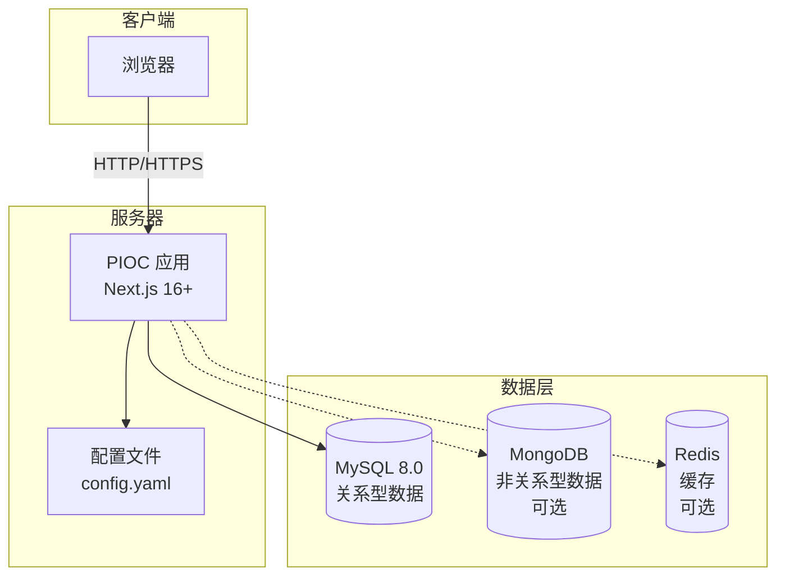
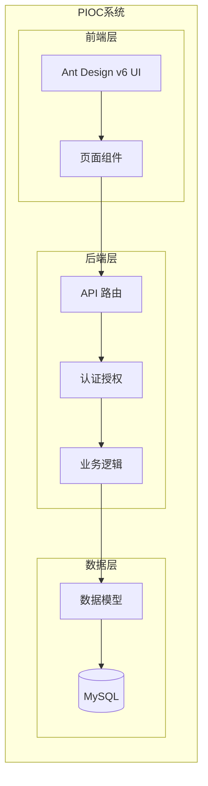

# PIOC 个人智慧运行中心 - 安装与初始化手册

## 目录

1. [系统概述](#1-系统概述)
2. [环境要求](#2-环境要求)
3. [安装步骤](#3-安装步骤)
4. [数据库配置](#4-数据库配置)
5. [系统配置](#5-系统配置)
6. [初始化系统](#6-初始化系统)
7. [启动系统](#7-启动系统)
8. [Docker 部署](#8-docker-部署)
9. [常见问题](#9-常见问题)
10. [系统架构图](#10-系统架构图)

---

## 1. 系统概述

PIOC（Personal Intelligence Operations Center，个人智慧运行中心）是一个基于 Next.js 16+ 和 Ant Design v6 构建的个人数字化管理平台，提供用户管理、角色管理、应用管理和菜单管理等功能。

### 技术栈

| 分类 | 技术 | 版本 |
|------|------|------|
| 前端框架 | Next.js | 16.2.0 |
| UI 组件库 | Ant Design | 6.3.3 |
| 前端框架 | React | 19.2.4 |
| 后端运行时 | Node.js | 20+ |
| 数据库 | MySQL | 8.0+ |
| 数据库驱动 | mysql2 | 3.20.0 |
| 认证 | JWT | 9.0.3 |

---

## 2. 环境要求

### 2.1 必需环境

- **Node.js**: 20.0 或更高版本
- **MySQL**: 8.0 或更高版本
- **npm**: 10.0 或更高版本（或 yarn/pnpm）

### 2.2 可选环境

- **MongoDB**: 5.0+（用于非关系型数据存储）
- **Redis**: 7.0+（用于缓存和会话管理）
- **Docker**: 20.0+（用于容器化部署）

### 2.3 检查环境

```bash
# 检查 Node.js 版本
node -v

# 检查 npm 版本
npm -v

# 检查 MySQL 版本
mysql --version
```

---

## 3. 安装步骤

### 3.1 克隆项目

```bash
# 克隆代码仓库
git clone <repository-url>
cd pioc
```

### 3.2 安装依赖

```bash
# 使用 npm 安装依赖
npm install

# 或使用 yarn
yarn install

# 或使用 pnpm
pnpm install
```

---

## 4. 数据库配置

### 4.1 MySQL 数据库准备

#### 方式一：本地安装 MySQL

确保 MySQL 服务已启动，并创建数据库：

```sql
-- 登录 MySQL
mysql -u root -p

-- 创建数据库
CREATE DATABASE mydb CHARACTER SET utf8mb4 COLLATE utf8mb4_unicode_ci;

-- 创建用户（可选）
CREATE USER 'pioc_user'@'localhost' IDENTIFIED BY 'your_password';
GRANT ALL PRIVILEGES ON mydb.* TO 'pioc_user'@'localhost';
FLUSH PRIVILEGES;
```

#### 方式二：使用 Docker 运行 MySQL

```bash
# 运行 MySQL 容器
docker run -d \
  --name mysql \
  -p 3306:3306 \
  -e MYSQL_ROOT_PASSWORD=root123 \
  -e MYSQL_DATABASE=mydb \
  -v mysql_data:/var/lib/mysql \
  mysql:8.0

# 查看容器状态
docker ps
```

### 4.2 数据库连接配置

复制配置文件模板：

```bash
cp config/config.yaml.example config/config.yaml
```

编辑 `config/config.yaml` 文件，配置数据库连接信息：

```yaml
database:
  host: "localhost"      # 数据库主机地址
  port: 3306             # 数据库端口
  username: "root"       # 数据库用户名
  password: "root123"    # 数据库密码
  name: "mydb"           # 数据库名称
  connectionLimit: 10    # 连接池大小
  charset: "utf8mb4"     # 字符集
```

---

## 5. 系统配置

### 5.1 基础配置

编辑 `config/config.yaml` 文件，根据实际环境修改以下配置：

```yaml
# 应用服务器配置
app:
  port: 8080
  name: "个人智慧运行中心"
  version: "1.0.0"
  description: "Personal Intelligence Operation Center"

# 安全配置
security:
  jwtSecret: "change-this-to-a-random-secret-key"  # 修改为随机密钥
  jwtExpireDays: 7
  sessionCookieName: "pioc_auth_token"
  httpsEnabled: false
```

### 5.2 CAS 单点登录配置（可选）

如需集成 CAS 单点登录，配置如下：

```yaml
cas:
  enabled: true
  serverUrl: "https://ids.ynu.edu.cn"
  pathPrefix: "/authserver"
  serviceUrl: "http://localhost:8080"
  version: "3.0"
  strictSSL: true
  loginPath: "/login"
  validatePath: "/p3/serviceValidate"
  attributeMapping:
    username: "username"
    email: "email"
    name: "name"
  defaultRoleId: 2
```

### 5.3 企业微信配置（可选）

```yaml
wechat:
  enabled: false
  corpId: ""
  agentId: ""
  secret: ""
```

---

## 6. 初始化系统

### 6.1 初始化数据库

运行数据库初始化脚本，创建数据表和默认数据：

```bash
# 执行数据库初始化
npm run db:init
```

初始化脚本将自动完成以下操作：

1. **创建数据表**
   - `pioc_users` - 用户表
   - `pioc_roles` - 角色表
   - `pioc_user_roles` - 用户角色关联表
   - `pioc_apps` - 应用表
   - `pioc_role_apps` - 角色应用关联表
   - `pioc_sessions` - 会话表
   - `pioc_menus` - 菜单表

2. **插入默认数据**
   - 内置角色：admin（系统管理员）、user（普通用户）、guest（访客）
   - 内置应用：用户管理、角色管理、应用管理、菜单管理、我的应用
   - 默认菜单：控制台、用户管理、角色管理、应用管理、菜单管理

3. **创建默认管理员账号**
   - 用户名：`admin`
   - 密码：`admin123`
   - 角色：系统管理员

### 6.2 验证初始化

```bash
# 登录 MySQL 查看创建的表
mysql -u root -p mydb -e "SHOW TABLES;"

# 查看默认用户
mysql -u root -p mydb -e "SELECT id, username, email, name FROM pioc_users;"

# 查看默认角色
mysql -u root -p mydb -e "SELECT id, name, description FROM pioc_roles;"
```

---

## 7. 启动系统

### 7.1 开发模式

```bash
# 启动开发服务器
npm run dev
```

系统将在 http://localhost:8080 启动，支持热重载。

### 7.2 生产模式

```bash
# 构建生产版本
npm run build

# 启动生产服务器
npm start
```

### 7.3 访问系统

- **前台地址**: http://localhost:8080
- **登录页面**: http://localhost:8080/login
- **默认管理员账号**:
  - 用户名：`admin`
  - 密码：`admin123`

---

## 8. Docker 部署

### 8.1 构建 Docker 镜像

```bash
# 构建镜像
docker build -t pioc:latest .

# 查看构建的镜像
docker images | grep pioc
```

### 8.2 使用 Docker Compose 部署

创建 `docker-compose.yml` 文件：

```yaml
version: '3.8'

services:
  pioc:
    build: .
    ports:
      - "8080:8080"
    environment:
      - NODE_ENV=production
    volumes:
      - ./config:/app/config:ro
    depends_on:
      - mysql
    networks:
      - pioc-network

  mysql:
    image: mysql:8.0
    ports:
      - "3306:3306"
    environment:
      - MYSQL_ROOT_PASSWORD=root123
      - MYSQL_DATABASE=mydb
    volumes:
      - mysql-data:/var/lib/mysql
    networks:
      - pioc-network

volumes:
  mysql-data:

networks:
  pioc-network:
    driver: bridge
```

启动服务：

```bash
# 启动所有服务
docker-compose up -d

# 查看服务状态
docker-compose ps

# 查看日志
docker-compose logs -f pioc
```

### 8.3 在容器内初始化数据库

```bash
# 进入容器执行初始化
docker-compose exec pioc npm run db:init
```

---

## 9. 常见问题

### 9.1 数据库连接失败

**问题现象**: 启动时提示数据库连接错误

**解决方案**:
1. 检查 MySQL 服务是否启动
2. 检查 `config/config.yaml` 中的数据库配置
3. 检查防火墙是否放行 3306 端口
4. 验证数据库用户权限

```bash
# 测试数据库连接
mysql -u root -p -h localhost -e "SELECT 1;"
```

### 9.2 端口被占用

**问题现象**: `Error: listen EADDRINUSE: address already in use :::8080`

**解决方案**:
1. 修改 `config/config.yaml` 中的 `app.port`
2. 或关闭占用 8080 端口的进程

```bash
# 查找占用 8080 端口的进程
lsof -i :8080

# 结束进程
kill -9 <PID>
```

### 9.3 初始化脚本执行失败

**问题现象**: `npm run db:init` 报错

**解决方案**:
1. 检查数据库连接配置
2. 检查数据库是否存在
3. 检查用户是否有创建表的权限
4. 查看详细错误日志

### 9.4 缺少配置文件

**问题现象**: `Configuration file not found`

**解决方案**:
```bash
# 复制配置文件模板
cp config/config.yaml.example config/config.yaml

# 编辑配置文件
vim config/config.yaml
```

### 9.5 依赖安装失败

**问题现象**: `npm install` 报错

**解决方案**:
1. 检查 Node.js 版本是否符合要求
2. 清除 npm 缓存
3. 使用镜像源

```bash
# 清除缓存
npm cache clean --force

# 使用淘宝镜像
npm config set registry https://registry.npmmirror.com

# 重新安装
npm install
```

---

## 10. 系统架构图

### 10.1 部署架构图



### 10.2 系统模块图



### 10.3 数据库 ERD 图

```mermaid
erDiagram
    pioc_users ||--o{ pioc_user_roles : has
    pioc_roles ||--o{ pioc_user_roles : assigned_to
    pioc_roles ||--o{ pioc_role_apps : has_permission
    pioc_apps ||--o{ pioc_role_apps : accessible_by
    pioc_apps ||--o{ pioc_menus : linked_to
    pioc_menus ||--o{ pioc_menus : parent_of

    pioc_users {
        int id PK
        string username
        string email
        string password
        string name
        tinyint status
        timestamp created_at
        timestamp updated_at
    }

    pioc_roles {
        int id PK
        string name
        string description
        tinyint is_builtin
        timestamp created_at
        timestamp updated_at
    }

    pioc_user_roles {
        int id PK
        int user_id FK
        int role_id FK
        timestamp created_at
    }

    pioc_apps {
        int id PK
        string name
        string description
        string icon
        string url
        tinyint status
        timestamp created_at
        timestamp updated_at
    }

    pioc_role_apps {
        int id PK
        int role_id FK
        int app_id FK
        timestamp created_at
    }

    pioc_menus {
        int id PK
        string name
        string path
        string icon
        int parent_id FK
        int sort_order
        tinyint status
        int app_id FK
        timestamp created_at
        timestamp updated_at
    }

    pioc_sessions {
        int id PK
        int user_id FK
        string token
        timestamp expires_at
        timestamp created_at
    }
```



---

## 附录

### A. 默认账号信息

| 账号类型 | 用户名 | 密码 | 角色 |
|---------|--------|------|------|
| 系统管理员 | admin | admin123 | admin |

### B. 内置角色说明

| 角色名 | 说明 | 权限 |
|--------|------|------|
| admin | 系统管理员 | 所有权限 |
| user | 普通用户 | 基础权限 |
| guest | 访客 | 只读权限 |

### C. 内置应用说明

| 应用名 | 路径 | 说明 |
|--------|------|------|
| 用户管理 | /users | 管理系统用户 |
| 角色管理 | /roles | 管理系统角色 |
| 应用管理 | /apps | 管理系统应用 |
| 菜单管理 | /menus | 管理导航菜单 |
| 我的应用 | /my-apps | 展示用户应用 |

### D. 常用命令

```bash
# 开发模式启动
npm run dev

# 构建生产版本
npm run build

# 生产模式启动
npm start

# 数据库初始化
npm run db:init

# 代码检查
npm run lint
```

---

**文档版本**: 1.0.0  
**更新日期**: 2026-03-24  
**适用系统版本**: PIOC v0.1.0+
